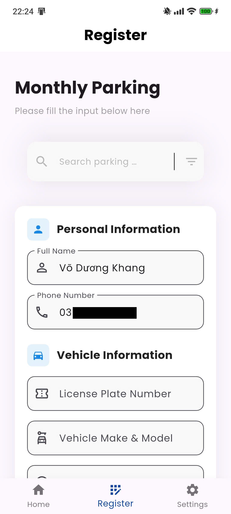

# Smart Parking Mobile App

A comprehensive Flutter mobile application for smart parking management system with real-time monitoring, monthly parking registration, and payment integration.

## Overview

Smart Parking is a mobile application that allows users to:
- Monitor real-time parking lot availability
- View their parked vehicles and parking status
- Register for monthly parking subscriptions
- Make payments via QR code
- Track parking history and environment data

## Features

### 🏠 Home Page
- Real-time parking slot availability (Empty/Parked/Total)
- User's parked vehicles with status indicators:
  - ✅ Parked correctly (num_slot = 0)
  - 🟠 Parked in multiple slots (num_slot = 1 with slot_name)
  - 🔴 Parked incorrectly (num_slot = 1 without slot_name)
- Environment monitoring (Temperature, Humidity, Light)
- Auto-refresh every 15-30 seconds
- QR code display for quick identification
- Multiple parking lot selection


### 📝 Registration
- Monthly parking subscription registration
- Search and select parking locations
- Vehicle information input with validation
- License plate format validation (Format: 2 digits + 1 uppercase letter + 4-5 digits, e.g., 30A99999)
- Multiple subscription plans (1/3/6/12 months)
- QR code payment integration


### 🔐 Authentication
- Login with phone number and password validation
- User registration (Sign up) with comprehensive validation
- Phone number format: 10 digits starting with 03/05/07/09
- Password requirements: 6-20 characters
- Session management with Provider

### ⚙️ Settings
- View registered parking lots
- Parking history tracking
- User profile management
- Logout functionality

## Validation Rules

### Login (TC_100)
- **Phone Number:**
  - Must be exactly 10 digits
  - Must start with 03, 05, 07, or 09
  - Only numeric characters allowed
  
- **Password:**
  - Minimum 6 characters
  - Maximum 20 characters

### Sign Up (TC_200)
- **Full Name:**
  - Minimum 2 characters
  - Required field
  
- **Phone Number:** Same as login requirements
  
- **Password & Confirm Password:**
  - Minimum 6 characters
  - Maximum 20 characters
  - Must match

### License Plate Registration (TC_300)
- **Format:** 2 digits + 1 uppercase letter + 4-5 digits
- **Valid Examples:** 30A99999, 30A9999
- **Invalid Examples:** A99999, 99999, 30@99999, 30a99999, 300A99999, 30A999
- **Duplicate Check:** API validates if license plate is already registered

## Tech Stack

- **Framework:** Flutter 3.x
- **State Management:** Provider
- **Backend API:** Flask REST API (Cloud server)
- **Storage:** SharedPreferences for local data
- **QR Code:** qr_flutter, flutter_svg
- **HTTP Client:** http package

## Installation

### Prerequisites
- Flutter SDK (3.0 or higher)
- Dart SDK
- Android Studio / VS Code
- Android device or emulator

### Setup Steps

1. **Clone the repository**
   ```bash
   git clone <repository-url>
   cd smart_parking
   ```

2. **Install dependencies**
   ```bash
   flutter pub get
   ```

3. **Run the app**
   ```bash
   flutter run
   ```

4. **Build APK (Release)**
   ```bash
   # Build split APKs (recommended - no Developer Mode required)
   flutter build apk --release --split-per-abi
   
   # Build single APK (requires Developer Mode on Windows)
   flutter build apk --release
   ```

### APK Output Location
```
build/app/outputs/flutter-apk/
- app-armeabi-v7a-release.apk (for older Android devices)
- app-arm64-v8a-release.apk (for modern Android devices - recommended)
- app-x86_64-release.apk (for emulators)
```

## Project Structure

```
lib/
├── main.dart                 # App entry point
├── pages/                    # UI screens
│   ├── home.dart            # Home page with parking info
│   ├── login.dart           # Login page
│   ├── signin.dart          # Sign up page
│   ├── register.dart        # Monthly parking registration
│   ├── setting.dart         # Settings and profile
│   ├── payment_qr_page.dart # QR payment page
│   └── color.dart           # Color constants
├── services/                 # Business logic & API calls
│   ├── api_service.dart     # HTTP client wrapper
│   ├── auth_service.dart    # Authentication logic
│   ├── user_service.dart    # User-related APIs
│   ├── parking_service.dart # Parking-related APIs
│   ├── payment_service.dart # Payment logic
│   └── user_session.dart    # Session management (Provider)
└── assets/                   # Images, icons, fonts
    ├── icons/
    ├── images/
    └── fonts/
```

## Configuration

### Android Manifest
The app requires Internet permission for API calls:
```xml
<uses-permission android:name="android.permission.INTERNET"/>
```

### Dependencies
Key packages used in the project:
- `provider: ^6.1.2` - State management
- `shared_preferences: ^2.3.4` - Local storage
- `http: ^1.2.2` - HTTP requests
- `qr_flutter: ^4.1.0` - QR code generation
- `flutter_svg: ^2.0.10+1` - SVG support

## Testing

The application has been tested with comprehensive test cases covering:
- Login validation (TC_100_01 to TC_100_10)
- Sign up validation (TC_200_01 to TC_200_19)
- License plate validation (TC_300_05 to TC_300_13)

All test cases passed successfully.

## Known Issues & Solutions

### Build Issues
- **Developer Mode Required:** If you encounter "Building with plugins requires symlink support" on Windows, either:
  - Enable Developer Mode in Windows Settings
  - Use `--split-per-abi` flag to build split APKs

### Network Issues
- **Connection Failed:** Ensure you have internet connection and the cloud server is accessible
- **API Timeout:** The cloud server (Render) may be in sleep mode on first request, retry after a few seconds

## Contributing

1. Fork the repository
2. Create a feature branch (`git checkout -b feature/AmazingFeature`)
3. Commit your changes (`git commit -m 'Add some AmazingFeature'`)
4. Push to the branch (`git push origin feature/AmazingFeature`)
5. Open a Pull Request

## License

This project is part of a Smart parking system project.

## Contact

For questions or support, please contact the development team.

## Acknowledgments

- Flutter team for the excellent framework
- Backend API team for cloud server integration
- All contributors and testers

