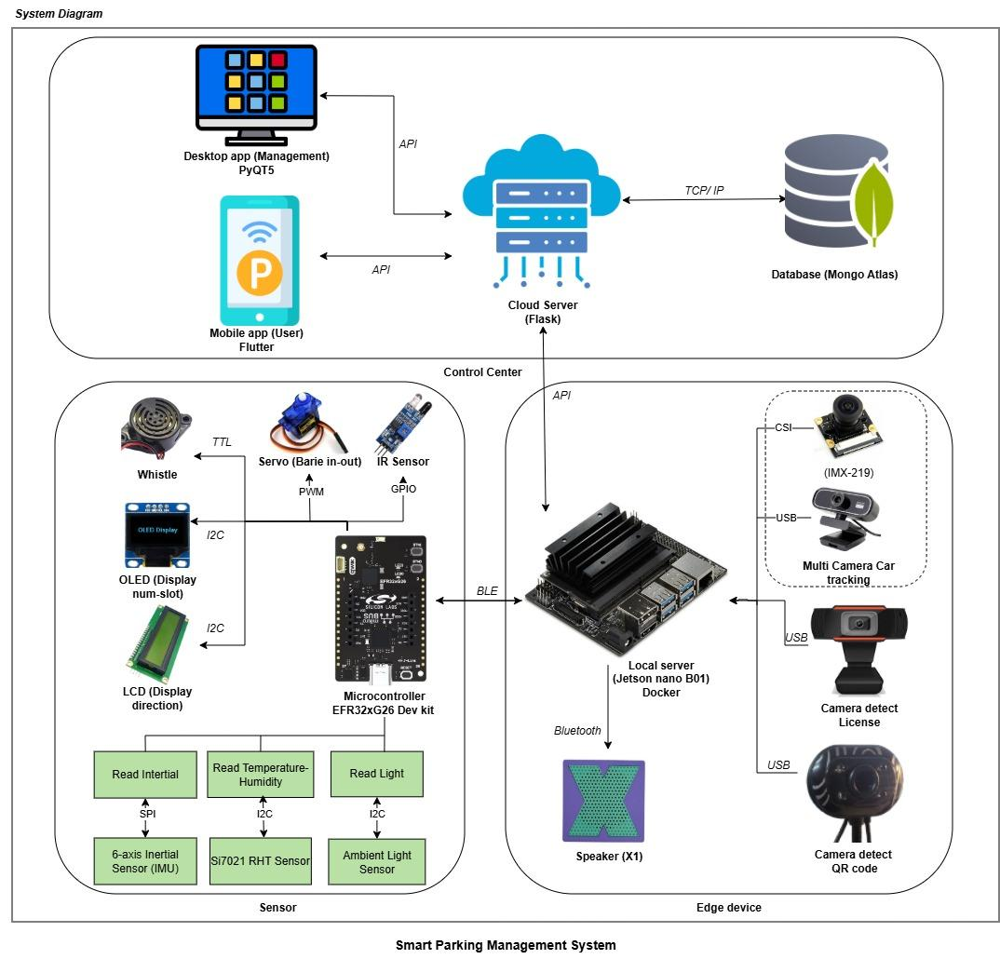
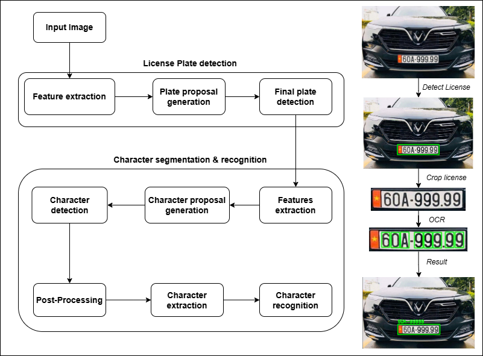
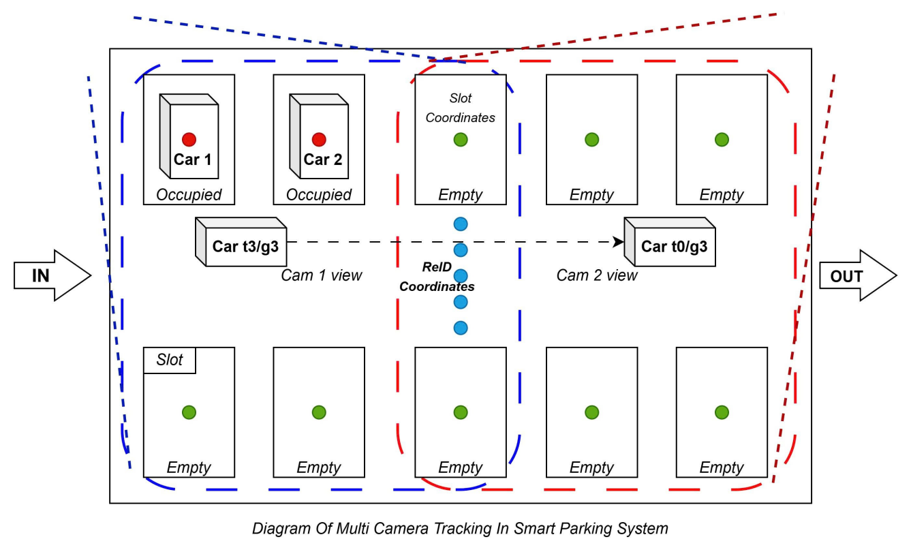
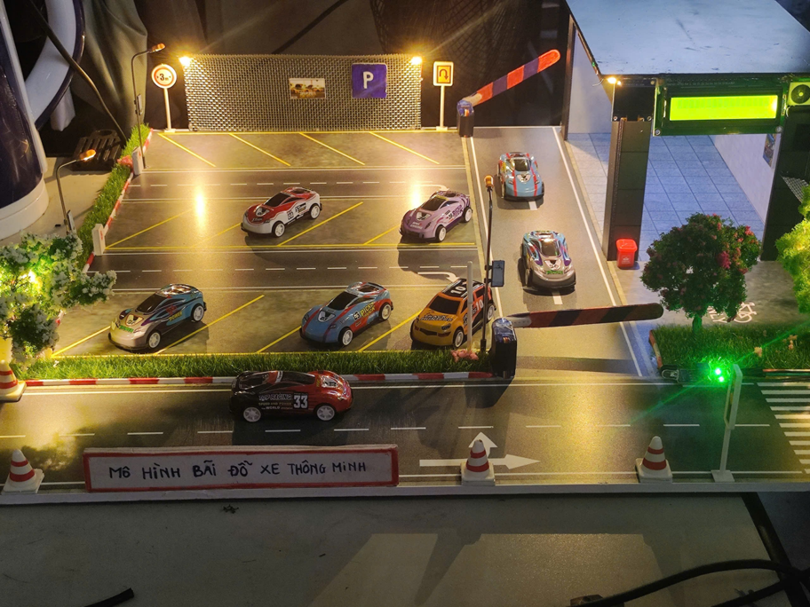
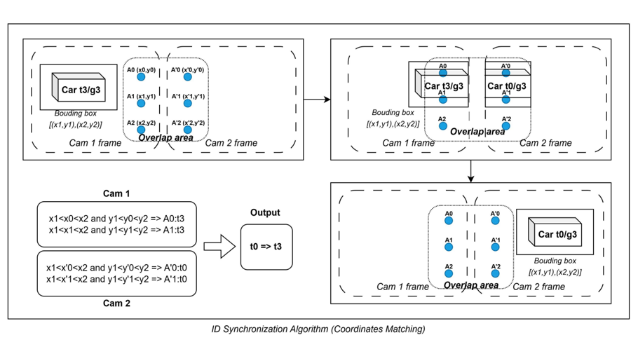
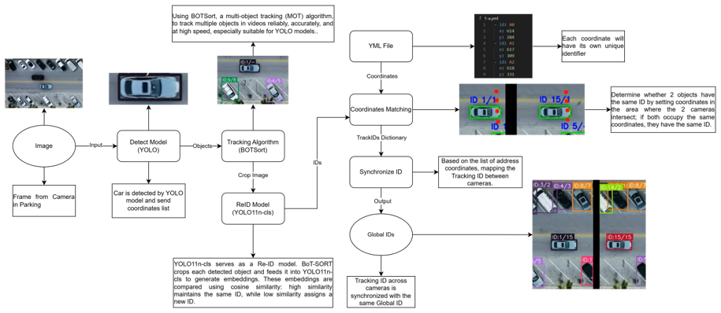

# 🚗 Hệ Thống Quản Lý Bãi Đỗ Xe Thông Minh (Smart Parking System)

## 📋 Tổng Quan

Hệ thống quản lý bãi đỗ xe thông minh tích hợp công nghệ IoT, Computer Vision, và Mobile App, cung cấp giải pháp toàn diện cho việc quản lý bãi đỗ xe tự động. Dự án kết hợp nhiều công nghệ tiên tiến:
- **Computer Vision & YOLO** - Nhận diện xe và biển số tự động
- **IoT với BLE** - Cảm biến thông minh và điều khiển barrier
- **Cloud Computing** - REST API backend trên MongoDB Atlas
- **Mobile & Desktop App** - Giao diện người dùng đa nền tảng

---

## 🏗️ Kiến Trúc Hệ Thống


*Sơ đồ kiến trúc tổng thể hệ thống Smart Parking*

### Kiến trúc chi tiết:

```
┌─────────────────────────────────────────────────────────────────┐
│                      Cloud Server (Flask)                        │
│                   MongoDB Atlas + REST API                       │
└──────────────┬──────────────────────────────────┬────────────────┘
               │                                  │
       ┌───────┴────────┐                ┌───────┴────────┐
       │  Mobile App    │                │  Desktop App   │
       │   (Flutter)    │                │    (PyQt5)     │
       └────────────────┘                └────────┬───────┘
                                                  │ MQTT
                                         ┌────────┴────────┐
                                         │  Local Server   │
                                         │  (Jetson Nano)  │
                                         │  YOLO + OpenCV  │
                                         └────────┬────────┘
                                                  │ BLE
                                    ┌─────────────┼─────────────┐
                                    │                           │
                              ┌─────┴──────┐            ┌──────┴──────┐
                              │ BGM220 MCU │            │ XG26 MCU    │
                              │ (Parking)  │            │ (Sensors)   │
                              └────────────┘            └─────────────┘
```

---

## 📁 Cấu Trúc Dự Án

Dự án được tổ chức thành 6 thành phần chính trong thư mục `projects/`:

### 1. 📱 **android-app** - Ứng dụng di động (Flutter)

**Mục đích**: Ứng dụng mobile cho người dùng cuối

**Công nghệ**: Flutter, Dart

**Tính năng chính**:
- 🏠 Theo dõi trạng thái bãi đỗ real-time
- 🚗 Quản lý xe đã đăng ký và xe đang đỗ
- 📝 Đăng ký gói đỗ xe theo tháng (1/3/6/12 tháng)
- 💳 Thanh toán qua QR code
- 🔐 Xác thực người dùng (đăng nhập/đăng ký)
- 📊 Xem lịch sử giao dịch
- 🌡️ Giám sát môi trường (nhiệt độ, độ ẩm, ánh sáng)

**Hỗ trợ nền tảng**: Android, iOS, Web, Windows, Linux, macOS

📖 [Chi tiết →](projects/android-app/README.md)

---

### 2. 🔧 **bgm220-mcu** - MCU điều khiển chính (Silicon Labs BGM220)

**Mục đích**: Điều khiển barrier, cảm biến và hiển thị thông tin

**Công nghệ**: C, Bluetooth Low Energy (BLE), Simplicity Studio

**Tính năng chính**:
- 🚦 Phát hiện xe ra/vào với **cảm biến IR**
- 🚧 Điều khiển **servo barrier** tự động
- 🌡️ Giám sát môi trường với **cảm biến ánh sáng** và **phát hiện lửa**
- 📺 Hiển thị thông tin trên **LCD 16x2** và **OLED 128x64**
- 📡 Giao tiếp BLE để truyền/nhận dữ liệu
- 🔊 Thông báo âm thanh (buzzer):
  - 1 beep (100ms): Phát hiện xe
  - 2 beep: Kết nối BLE
  - 3 beep: Ngắt kết nối BLE
  - 1 beep dài (500ms): Cảnh báo cháy
- 💾 Lưu trữ thống kê vào NVM3

📖 [Chi tiết →](projects/bgm220-mcu/readme.md)

---

### 3. 📡 **xg26-mcu** - MCU cảm biến phụ (Silicon Labs xG26)

**Mục đích**: Thu thập dữ liệu môi trường và truyền qua BLE

**Công nghệ**: C, Bluetooth Low Energy, Simplicity Studio

**Tính năng chính**:
- 🌡️ Thu thập dữ liệu cảm biến môi trường
- 📡 Truyền dữ liệu qua BLE GATT
- 🔋 Quản lý nguồn năng lượng (Deep Sleep EM4)
- 📱 Tương thích với Simplicity Connect App

**Ứng dụng**: Thunderboard/DevKit với các cảm biến tích hợp sẵn

📖 [Chi tiết →](projects/xg26-mcu/readme.md)

---

### 4. 🖥️ **local-server** - Edge Computing Server (Jetson Nano)

**Mục đích**: Xử lý Computer Vision và quản lý bãi đỗ cục bộ

**Công nghệ**: Python, YOLO v8, OpenCV, FastAPI

**Tính năng chính**:
- 🎥 **Multi-Camera Tracking** - Theo dõi xe qua nhiều camera
- 🚗 **Parking Slot Detection** - Phát hiện trạng thái trống/đầy (mAP@0.5: 72.4%)
- 🔖 **License Plate Recognition** - Nhận diện biển số xe Việt Nam (OCR)
- 📱 **QR Code Scanner** - Quét mã QR để xác thực ra/vào
- 🔄 **Vehicle Re-Identification** - Tracking xe đa camera
- 📡 **MQTT Integration** - Điều khiển IoT (đèn, barrier)
- 🔌 **BLE Communication** - Kết nối với BGM220/XG26

**Hiệu năng**:
- Latency < 300ms trên Jetson Nano
- Dataset: 1,000+ ảnh xe + 300 ảnh mô hình

**Hình ảnh minh họa**:

<p align="center">
  
  
</p>
<p align="center">
  <em>License Plate Recognition và Vehicle Re-Identification</em>
</p>

<p align="center">
  
</p>
<p align="center">
  <em>Mô hình bãi đỗ xe thực tế</em>
</p>

📖 [Chi tiết →](projects/local-server/README.md)

---

### 5. ☁️ **cloud-server** - Cloud Backend (Flask + MongoDB)

**Mục đích**: REST API backend và cơ sở dữ liệu trung tâm

**Công nghệ**: Python, Flask, MongoDB Atlas, Gunicorn

**Tính năng chính**:
- 👥 **Quản lý người dùng** - Đăng ký, đăng nhập, cập nhật thông tin
- 🅿️ **Quản lý bãi đỗ** - CRUD các bãi đỗ xe, trạng thái hoạt động
- 📝 **Đăng ký xe** - Quản lý biển số xe cho từng bãi
- 🚘 **Quản lý xe đậu** - Theo dõi xe đang đỗ trong bãi
- 📊 **Lịch sử giao dịch** - Lưu trữ và truy vấn lịch sử đậu xe
- 🗺️ **Tọa độ & Môi trường** - Quản lý vị trí và thông tin môi trường
- 🔍 **Tìm kiếm theo ngày** - Lọc lịch sử giao dịch

**Deployment**: Render.com với MongoDB Atlas

📖 [Chi tiết →](projects/cloud-server/README.md)

---

### 6. 🖼️ **windows-app** - Ứng dụng quản lý Desktop (PyQt5)

**Mục đích**: Giao diện quản lý cho nhân viên/quản trị viên

**Công nghệ**: Python, PyQt5, MQTT, REST API

**Tính năng chính**:
- 📊 **Dashboard** - Hiển thị real-time 15 slot đỗ xe (3 khu: A, B, C)
  - Trạng thái màu: Trống (xanh), Có xe (đỏ), Trùng biển (vàng)
  - Auto-refresh mỗi 10 giây
  - Thống kê: Tổng slot, trống, đã dùng, tỷ lệ sử dụng
- 📜 **History** - Lịch sử ra/vào với tìm kiếm và lọc theo ngày
- 🚗 **Active Cars** - Danh sách xe đang trong bãi với tính thời gian real-time
- 👥 **Customers** - Quản lý khách hàng đăng ký
- 📊 **Statistics** - Thống kê doanh thu, biểu đồ
- 📷 **Camera View** - Xem live camera
- ⚙️ **IoT Control** - Điều khiển đèn, barrier qua MQTT

📖 [Chi tiết →](projects/windows-app/README.md)

---

## 🚀 Hướng Dẫn Cài Đặt Nhanh

### 1. Cloud Server
```bash
cd projects/cloud-server
pip install -r requirements.txt
python app.py
```

### 2. Local Server (Jetson Nano)
```bash
cd projects/local-server
pip install -r requirements.txt
python main.py
```

### 3. Windows Desktop App
```bash
cd projects/windows-app
pip install -r requirements.txt
python main.py
```

### 4. Mobile App (Flutter)
```bash
cd projects/android-app
flutter pub get
flutter run
```

### 5. MCU Projects (BGM220 & xG26)
- Mở project trong **Simplicity Studio 5**
- Build với **GNU ARM v12.2.1**
- Flash vào board

---

## 🔗 Kết Nối Giữa Các Thành Phần

```
Mobile App ←──HTTP──→ Cloud Server ←──HTTP──→ Desktop App
                                                    ↓
                                                  MQTT
                                                    ↓
                                             Local Server
                                                    ↓
                                                  BLE
                                            ┌───────┴───────┐
                                            ↓               ↓
                                        BGM220          XG26
                                      (Parking)      (Sensors)
```

### Giao Thức Giao Tiếp

| Thành Phần | Giao Thức | Vai Trò |
|-----------|-----------|---------|
| Mobile App ↔ Cloud Server | HTTP/REST API | Truy vấn dữ liệu, đăng ký xe |
| Desktop App ↔ Cloud Server | HTTP/REST API | Quản lý bãi đỗ |
| Desktop App ↔ Local Server | MQTT | Điều khiển IoT (đèn, barrier) |
| Local Server ↔ BGM220 | BLE GATT | Truyền dữ liệu cảm biến |
| Local Server ↔ XG26 | BLE GATT | Thu thập dữ liệu môi trường |

---

## 📊 Công Nghệ & Stack

| Lớp | Công Nghệ |
|-----|-----------|
| **Mobile** | Flutter, Dart |
| **Desktop** | Python, PyQt5 |
| **Backend** | Flask, FastAPI, MongoDB Atlas |
| **Edge Computing** | YOLO v8, OpenCV, TensorRT |
| **Embedded** | C, BLE, Silicon Labs SDK |
| **Communication** | REST API, MQTT, Bluetooth Low Energy |
| **Deployment** | Render.com, Jetson Nano |

---

## 🎯 Kết Quả Đạt Được

- ✅ **Độ chính xác nhận diện**: mAP@0.5 = 72.4%
- ✅ **Latency**: < 300ms trên Jetson Nano
- ✅ **Tiết kiệm chi phí**: Giảm 80% so với cảm biến truyền thống
- ✅ **Tích hợp đa nền tảng**: Mobile, Desktop, Embedded
- ✅ **Tự động hóa hoàn toàn**: Từ phát hiện đến thanh toán

---

## 📸 Hình Ảnh Hệ Thống

### Sơ đồ Re-Identification

<p align="center">
  
</p>
<p align="center">
  <em>Chi tiết quá trình Re-Identification cho tracking xe đa camera</em>
</p>

<p align="center">
  
</p>
<p align="center">
  <em>Luồng xử lý Re-ID trong hệ thống</em>
</p>

---

## 📝 Giấy Phép

Dự án này được phát triển cho mục đích nghiên cứu và học tập.

---

## 👥 Đóng Góp

Dự án được phát triển như một phần của khóa luận tốt nghiệp (KLTN) năm học 2025-2026.

---

## 📞 Liên Hệ

Để biết thêm chi tiết về từng thành phần, vui lòng xem file README trong thư mục tương ứng.

---

**Ngày cập nhật**: 19/01/2026
